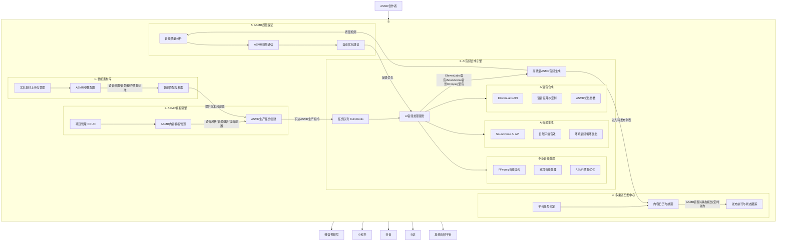

# PRD: Titan | 智能内容生产与分发平台 V1.1

## 文档信息

- **版本**: V1.1
- **创建日期**: 2025-01-11
- **最后更新**: 2025-01-12  
- **产品负责人**: 项目经理
- **开发团队**: Titan Development Team
- **文档状态**: 草案 (重大更新 - ASMR音频优先架构)
- **变更记录**: 参见 [CR-2025-001](/requirements/change-requests/CR-2025-001-ASMR-Audio-Priority-Architecture.md)

---

## 1. 产品愿景与目标 (Vision & Goals)

### 1.1 产品愿景
打造一个专注于高质量ASMR内容创作的智能音频生产与分发平台，通过AI驱动的音频合成技术，为ASMR创作者提供专业级的内容制作能力。

### 1.2 V1.1 目标
1. **实现ASMR音频优先闭环**: 跑通从"素材入库"到"高质量ASMR音频生成"，再到"多平台内容分发"的全流程
2. **建立专业音频技术栈**: 集成ElevenLabs AI语音合成、Soundverse AI音景生成和FFmpeg专业音频处理技术
3. **验证ASMR垂直市场价值**: 为专注于ASMR内容的创作团队提供专业级的音频制作工具，显著提升内容质量和制作效率

### 1.3 成功指标
- 能够成功批量生成50个高质量ASMR音频内容
- ASMR音频质量评分达到4.5/5.0以上
- 音频处理时间控制在60秒/分钟以内
- 用户能够在30分钟内完成从文本输入到ASMR音频发布的完整流程

---

## 2. 用户画像与核心场景 (User Persona & Core Scenarios)

### 2.1 目标用户
**主要用户**: ASMR内容创作团队（内容策划、音频编辑、运营发布）
- 专注于ASMR内容创作，注重音频质量和用户体验
- 需要批量制作高质量ASMR音频内容
- 希望通过AI技术提升制作效率和内容一致性
- 对音频细节要求高，需要专业级的音频处理能力

### 2.2 核心使用场景

#### 场景一: ASMR文本素材管理
**角色**: 内容策划小王  
**目标**: 准备用于ASMR音频生成的文本内容和配置参数  
**流程**: 
1. 登录Titan平台
2. 进入素材库页面
3. 上传ASMR引导文本，标记为"ASMR脚本"类型，添加"放松、睡眠、冥想"标签
4. 配置语音参数（稳定性、相似度、风格等）
5. 设置音景偏好（雨声、海浪、篝火等）
6. 系统自动分析文本特征和ASMR适配度

#### 场景二: 批量ASMR音频生产
**角色**: 音频编辑小李  
**目标**: 批量生成高质量ASMR音频内容  
**流程**:
1. 创建新项目"深度睡眠ASMR系列"
2. 选择"温柔女声+雨声"ASMR模板
3. 批量选择50段ASMR引导文本
4. 配置AI语音合成参数（使用ElevenLabs高质量语音）
5. 选择配套的AI生成音景（使用Soundverse AI）
6. 设置双耳音频处理和空间音效参数
7. 启动批量生产，系统自动生成50个ASMR音频文件

#### 场景三: ASMR内容质量优化与分发
**角色**: 运营发布小李  
**目标**: 确保音频质量并执行分发计划  
**流程**:
1. 在内容管理页面预览生成的50个ASMR音频
2. 使用内置质量评估工具检查音频指标
3. 对不符合标准的音频进行重新生成或手动调优
4. 为每个音频添加简单的静态视觉（用于视频平台）
5. 设定多平台发布策略（微信视频号、小红书、抖音等）
6. 系统按计划自动执行发布任务

---

## 3. 产品功能架构

### 3.1 系统架构图

### 3.2 技术架构
- **前端**: Next.js + TypeScript + PrimeReact + Tailwind CSS
- **后端**: NestJS + MikroORM + PostgreSQL
- **AI音频服务**: ElevenLabs API + Soundverse AI API
- **音频处理**: FFmpeg + 专业音频滤镜和双耳处理
- **消息队列**: Redis + Bull Queue (处理AI音频生成任务)
- **文件存储**: 阿里云OSS (优化音频文件存储)
- **部署**: Docker + Docker Compose

---

## 4. 功能详细说明

### 4.1 模块一：ASMR智能素材库 (ASMR Asset Library)

#### 4.1.1 ASMR文本素材上传功能 [F-1.1]
**功能描述**: 专门针对ASMR内容的文本素材管理和配置

**具体功能**:
- ASMR脚本文本上传（支持批量）
- 语音参数预设配置和保存
- 支持的文件格式：
  - 文本：TXT, MD, DOCX (ASMR引导脚本)
  - 语音配置：JSON (ElevenLabs参数配置)
  - 音景配置：JSON (Soundverse AI配置)
  - 参考音频：MP3, WAV (用于语音克隆)

**必需字段**:
- 素材类型（下拉选择）：ASMR脚本、语音配置、音景配置、参考音频
- ASMR标签（多选）：睡眠、放松、冥想、学习专注、焦虑缓解
- 语音风格：温柔女声、沉稳男声、自然中性、个性化克隆
- 音景类型：自然环境、室内环境、白噪音、音乐性环境

**验收标准**:
- [ ] 能够成功上传ASMR文本脚本
- [ ] 支持语音参数配置预览
- [ ] 文本ASMR适配度分析
- [ ] 批量上传处理正确
- [ ] 参数配置验证和提示

#### 4.1.2 ASMR素材智能匹配 [F-1.2]
**功能描述**: 基于ASMR特性的智能素材匹配和推荐

**界面布局**:
- 左侧：ASMR筛选面板（风格、情绪、时长、质量等级）
- 主区域：ASMR素材卡片视图（显示音频波形预览）
- 右侧：ASMR参数配置面板（语音设置、音景设置、混音设置）

**ASMR专用筛选功能**:
- 按ASMR类型筛选（睡眠引导、放松冥想、专注学习等）
- 按情绪标签筛选（平静、舒缓、温暖、安全感）
- 按时长筛选（短片段<5分钟、中等5-15分钟、长片段>15分钟）
- 语音特征搜索（音调、语速、口音、风格）

**验收标准**:
- [ ] ASMR特征筛选准确
- [ ] 音频预览播放功能
- [ ] 智能推荐相关素材
- [ ] 参数配置实时预览

#### 4.1.3 ASMR参数配置管理 [F-1.3]
**功能描述**: 专业的ASMR音频参数配置和管理

**ElevenLabs语音配置**:
- 稳定性 (Stability): 0.0-1.0，影响语音一致性
- 相似度增强 (Similarity Boost): 0.0-1.0，影响声音相似度
- 风格 (Style): 0.0-1.0，影响表达风格强度
- 说话者增强 (Speaker Boost): 布尔值，增强说话者特征

**Soundverse音景配置**:
- 音景类型：雨声、海浪、篝火、森林、白噪音等
- 强度级别：1-10级，控制音景明显程度
- 循环模式：无缝循环、淡入淡出、自然变化
- 空间感：立体声、双耳、环绕声效果

**FFmpeg混音配置**:
- 语音音量：0-100%，控制人声音量
- 音景音量：0-100%，控制背景音音量
- 淡入淡出：0-10秒，控制开始结束过渡
- 双耳处理：启用/禁用3D空间音效
- 频率均衡：低频、中频、高频调节

**验收标准**:
- [ ] 所有参数可视化配置
- [ ] 参数组合预设保存
- [ ] 实时效果预览
- [ ] 参数验证和范围检查

### 4.2 模块二：ASMR项目与模板引擎 (ASMR Project & Template Engine)

#### 4.2.1 ASMR项目管理 [F-2.1]
**功能描述**: 以ASMR项目为单位组织音频内容创作活动

**项目属性**:
- 项目名称（必填）：如"深度睡眠ASMR系列"
- ASMR主题类型：睡眠引导、放松冥想、学习专注、焦虑缓解
- 目标用户群体：成人、老年人、学生、职场人士
- 音频时长规划：短片段(3-5分钟)、中等(10-15分钟)、长片段(20-60分钟)
- 预期生成数量：批量制作的音频文件数量
- 质量等级要求：标准、高质量、专业级

**基本操作**:
- 创建ASMR项目
- 编辑项目ASMR参数和目标设定
- 删除项目（需确认，会同时删除关联的音频生成任务）
- 项目列表查看（支持按ASMR类型搜索和排序）

**验收标准**:
- [ ] ASMR项目CRUD操作功能完整
- [ ] ASMR参数验证正确
- [ ] 权限控制（用户只能操作自己的项目）
- [ ] 项目模板化配置

#### 4.2.2 ASMR素材关联与组合 [F-2.2]
**功能描述**: 在ASMR项目中智能选择和管理音频制作素材

**具体功能**:
- 从素材库添加ASMR文本脚本到项目
- 语音风格与文本内容智能匹配
- 音景类型与ASMR主题自动推荐
- 批量文本处理和参数批量应用

**界面设计**:
- 三栏布局：左侧文本素材库，中间项目配置区，右侧音频参数面板
- 支持拖拽操作和批量选择
- 实时预览语音合成效果

**验收标准**:
- [ ] 素材添加/移除功能正常
- [ ] 智能匹配推荐准确
- [ ] 批量操作处理正确
- [ ] 参数关联关系维护准确

#### 4.2.3 ASMR内容模板管理 [F-2.3]
**功能描述**: 创建和管理ASMR专用的内容生产模板

**模板组成**:
- 模板名称和ASMR用途描述
- 语音风格配置（ElevenLabs参数预设）
- 音景类型配置（Soundverse AI预设）
- 混音参数配置（FFmpeg音频处理参数）
- 质量标准设定（采样率、比特率、声道配置）

**预置ASMR模板**:
- **"温柔女声+雨声"模板**: 适合睡眠引导和放松
  - 语音：高稳定性(0.8)、温柔风格(0.2)、女声音色
  - 音景：轻柔雨声、森林环境、低强度(3/10)
  - 混音：语音70%、音景30%、3秒淡入淡出

- **"沉稳男声+篝火"模板**: 适合冥想和专注
  - 语音：高稳定性(0.9)、沉稳风格(0.3)、男声音色
  - 音景：篝火crackling声、室内环境、中强度(5/10)
  - 混音：语音75%、音景25%、5秒淡入淡出

- **"自然中性+海浪"模板**: 适合通用放松
  - 语音：中等稳定性(0.7)、自然风格(0.1)、中性音色
  - 音景：海浪声、海滨环境、中强度(4/10)
  - 混音：语音65%、音景35%、双耳处理启用

**验收标准**:
- [ ] ASMR模板创建和编辑功能完整
- [ ] 模板参数配置清晰准确
- [ ] 模板可以被正确应用到生产任务
- [ ] 预置模板质量满足ASMR标准

### 4.3 模块三：AI音频合成引擎 (AI Audio Synthesis Engine)

#### 4.3.1 ASMR批量生产任务创建 [F-3.1]
**功能描述**: 基于ASMR模板和文本素材批量创建音频生产任务

**操作流程**:
1. 选择ASMR内容模板
2. 批量选择ASMR文本脚本
3. 设置AI生成策略（语音个性化、音景变化等）
4. 配置质量参数（采样率、时长、音频格式）
5. 预览生产计划和成本估算
6. 确认并创建AI音频生成任务

**ASMR生成策略**:
- **一致性策略**: 相同语音风格+音景，确保系列内容一致性
- **变化性策略**: 语音风格固定，音景类型变化，增加丰富性
- **个性化策略**: 根据文本内容自动调整语音参数和音景选择

**验收标准**:
- [ ] 支持所有ASMR生成策略
- [ ] 批量任务预览功能准确
- [ ] 成本估算和时间预估准确
- [ ] 任务创建成功率100%

#### 4.3.2 AI音频处理服务 [F-3.2]
**功能描述**: 后台处理ASMR音频合成任务

**ElevenLabs语音合成能力**:
- **高质量语音生成**: 使用ElevenLabs API进行ASMR优化语音合成
- **语音克隆服务**: 支持用户上传音频样本进行个性化语音克隆
- **ASMR参数优化**: 针对ASMR用途的语音参数自动调优
- **多语言支持**: 中文、英文等多语言ASMR内容生成

**Soundverse AI音景生成能力**:
- **自然环境音效**: 雨声、海浪、森林、风声等自然音景
- **室内环境音效**: 篝火、时钟滴答、咖啡厅环境等
- **白噪音生成**: 粉噪音、棕噪音、白噪音等专注音频
- **无缝循环优化**: 确保音景可以长时间循环播放

**FFmpeg专业音频处理能力**:
- **多轨音频混合**: 语音、音景、可选背景音乐的专业混音
- **双耳音频处理**: 3D空间音效和双耳节拍处理
- **动态范围控制**: 压缩、限制器确保音频动态范围适合ASMR
- **频率均衡优化**: 专门针对ASMR的频率响应优化

**技术实现**:
- 使用Bull Queue管理AI音频生成任务
- 实时进度更新和状态跟踪
- 智能错误处理和重试机制
- 音频质量自动验证

**性能要求**:
- 单个ASMR音频处理时间 < 60秒/分钟音频内容
- 支持并发处理多个AI音频任务
- 内存使用优化，支持长时间音频处理
#### 4.3.3 ASMR音频质量管理 [F-3.3]
**功能描述**: 管理和优化生成的ASMR音频内容

**功能列表**:
- ASMR音频列表查看（音频波形、质量评分、生成时间）
- 专业音频播放器（支持双耳音效预览）
- 音频质量分析和评估
- ASMR效果评估（基于算法和用户反馈）
- 自动质量优化建议
- 批量质量处理（重新生成、参数调优）

**ASMR质量评估指标**:
- **技术指标**: 采样率、比特率、动态范围、频率响应
- **ASMR指标**: 语音清晰度、音景协调性、双耳效果、放松效果
- **用户体验**: 音频流畅性、音量一致性、无杂音、适合循环

**状态定义**:
- 处理中：AI音频生成进行中
- 质检中：自动质量评估进行中
- 已完成：生成成功，质量合格，待发布
- 需优化：质量不达标，需要重新处理
- 已发布：已发布到各平台
- 失败：生成失败或质量严重不合格

**验收标准**:
- [ ] ASMR音频质量评估准确
- [ ] 音频播放功能支持专业特性
- [ ] 自动优化建议实用
- [ ] 批量处理功能稳定

### 4.4 模块四：多平台ASMR内容分发中心 (Multi-platform ASMR Distribution)

#### 4.4.1 平台账号管理 [F-4.1]
**功能描述**: 管理和绑定各个内容发布平台账号

**支持平台**:
- **微信视频号**: OAuth2授权流程，支持ASMR视频发布
- **小红书**: API集成，支持音频内容+图片发布
- **抖音**: 开放平台集成，支持ASMR短视频发布
- **B站**: UP主工具集成，支持音频专栏和视频发布
- **网易云音乐**: 音乐人平台，支持ASMR音频专辑发布

**安全措施**:
- 所有平台Token使用AES-256加密存储
- 定期检查授权状态和有效期
- 异常情况自动告警和处理
- 支持多账号管理和切换

**验收标准**:
- [ ] 所有平台授权流程完整无误
- [ ] Token安全存储和更新
- [ ] 平台状态检查准确
- [ ] 多账号管理功能正常

#### 4.4.2 ASMR内容发布与排期 [F-4.2]
**功能描述**: 管理ASMR内容发布计划和执行

**发布策略**:
- **立即发布**: 选择ASMR音频立即发布到指定平台
- **定时发布**: 设定具体发布时间，适合定期ASMR内容
- **智能排期**: AI推荐最佳发布时间（基于用户活跃度分析）
- **批量发布**: 批量设置多个ASMR内容的发布计划

**ASMR内容适配**:
- **纯音频平台**: 直接发布高质量ASMR音频文件
- **视频平台**: 自动生成静态视觉+ASMR音频的视频文件
- **图文平台**: 生成ASMR音频+配套放松图片的组合内容
- **专栏平台**: 生成ASMR介绍文字+音频嵌入的专栏内容

**内容日历**:
- 月视图/周视图/日视图的ASMR发布计划
- 拖拽式排期，支持ASMR系列内容规划
- 不同平台发布时间冲突检测
- ASMR内容标签和主题可视化管理

**验收标准**:
- [ ] 发布功能稳定可靠
- [ ] 定时发布准确执行
- [ ] 内容适配质量良好
- [ ] 日历操作流畅

#### 4.4.3 发布状态跟踪与数据分析 [F-4.3]
**功能描述**: 跟踪ASMR内容发布结果和效果分析

**状态跟踪**:
- 待发布：已排期但未执行的ASMR内容
- 发布中：正在上传和发布过程中
- 发布成功：已成功发布到平台
- 发布失败：发布失败（显示具体失败原因）
- 审核中：平台审核中（部分平台需要内容审核）

**ASMR效果分析**:
- **播放数据**: 播放量、完播率、循环播放次数
- **用户反馈**: 点赞、收藏、评论情绪分析
- **ASMR效果**: 用户反馈的放松效果、睡眠质量改善
- **平台表现**: 不同平台的ASMR内容表现对比

**通知机制**:
- ASMR内容发布成功/失败通知
- 每日ASMR发布摘要和数据报告
- 异常情况告警（发布失败、审核被拒等）
- 热门ASMR内容推送和趋势分析

**验收标准**:
- [ ] 状态跟踪实时准确
- [ ] 数据分析维度完整
- [ ] 通知机制及时有效
- [ ] 报告内容实用
- [ ] 编辑功能正常工作
- [ ] 预览功能支持所有文件类型
- [ ] 删除操作有确认机制
- [ ] 批量操作性能良好

### 4.2 模块二：项目与模板引擎 (Project & Template Engine)

#### 4.2.1 项目管理 [F-2.1]
**功能描述**: 以项目为单位组织内容生产活动

**项目属性**:
- 项目名称（必填）
- 项目描述
- 创建时间
- 项目状态（进行中、已完成、已暂停）
- 关联素材数量
- 生成内容数量

**基本操作**:
- 创建项目
- 编辑项目信息
- 删除项目（需确认，会同时删除关联的生产任务）
- 项目列表查看（支持搜索和排序）

**验收标准**:
- [ ] CRUD操作功能完整
- [ ] 数据验证正确
- [ ] 权限控制（用户只能操作自己的项目）

#### 4.2.2 项目素材关联 [F-2.2]
**功能描述**: 在项目中选择和管理所需素材

**具体功能**:
- 从素材库添加素材到项目
- 项目内素材列表展示
- 移除项目素材关联
- 素材使用统计

**界面设计**:
- 双栏布局：左侧素材库，右侧项目素材
- 支持拖拽操作
- 批量选择功能

**验收标准**:
- [ ] 添加/移除功能正常
- [ ] 界面交互流畅
- [ ] 关联关系正确维护

#### 4.2.3 生产模板管理 [F-2.3]
**功能描述**: 创建和管理内容生产模板

**模板组成**:
- 模板名称和描述
- 素材插槽定义（每个插槽指定素材类型）
- 视频参数设置（分辨率、时长、帧率）
- 布局和样式设置（水印位置、字幕样式）

**预置模板**:
- "图文ASMR模板"：背景图 + BGM + 字幕文本
- "双人对话模板"：两路人声 + 背景图 + BGM
- "风景冥想模板"：风景视频 + 冥想音乐 + 引导词

**验收标准**:
- [ ] 模板创建和编辑功能完整
- [ ] 插槽定义清晰准确
- [ ] 模板可以被正确应用到生产任务

### 4.3 模块三：内容合成引擎 (Content Synthesis Engine)

#### 4.3.1 批量生产任务创建 [F-3.1]
**功能描述**: 基于模板和素材批量创建内容生产任务

**操作流程**:
1. 选择生产模板
2. 为每个插槽批量选择素材
3. 设置匹配策略（一对一、笛卡尔积、随机组合）
4. 预览生产计划
5. 确认并创建任务

**匹配策略说明**:
- **一对一**: 第1张图+第1段音频，第2张图+第2段音频...
- **笛卡尔积**: 每张图都与每段音频组合
- **随机组合**: 系统随机匹配素材

**验收标准**:
- [ ] 支持所有匹配策略
- [ ] 预览功能准确
- [ ] 任务创建成功率100%

#### 4.3.2 媒体处理服务 [F-3.2]
**功能描述**: 后台处理内容合成任务

**核心能力**:
- **视频合成**: 图片序列转视频、视频片段拼接
- **音频混合**: 多轨音频混合、音量调节
- **字幕渲染**: 文本转字幕、字幕样式设置
- **水印添加**: Logo叠加、位置和透明度控制

**技术实现**:
- 使用FFmpeg进行媒体处理
- Redis队列管理任务
- 进度实时更新
- 错误处理和重试机制

**性能要求**:
- 单个视频处理时间 < 30秒
- 支持并发处理多个任务
- 内存使用优化

#### 4.3.3 成品内容管理 [F-3.3]
**功能描述**: 管理和预览生成的内容

**功能列表**:
- 成品列表查看（缩略图、状态、创建时间）
- 视频预览播放
- 下载功能
- 发布状态管理
- 批量操作（删除、发布）

**状态定义**:
- 处理中：正在生成
- 已完成：生成成功，待发布
- 已发布：已发布到平台
- 失败：生成失败

### 4.4 模块四：多渠道分发中心 (Distribution Center)

#### 4.4.1 渠道账号管理 [F-4.1]
**功能描述**: 管理和绑定发布渠道账号

**微信视频号集成**:
- OAuth2授权流程
- Token安全存储（AES-256加密）
- 账号状态检查
- 授权续期提醒

**安全措施**:
- 加密存储所有Token
- 定期检查授权状态
- 异常自动告警

**验收标准**:
- [ ] 授权流程完整无误
- [ ] Token安全存储
- [ ] 状态检查准确

#### 4.4.2 内容发布与排期 [F-4.2]
**功能描述**: 管理内容发布计划和执行

**发布方式**:
- **立即发布**: 选择内容立即发布
- **定时发布**: 设定具体发布时间
- **周期发布**: 设定发布规则（每天、每周等）

**内容日历**:
- 月视图/周视图/日视图
- 拖拽式排期
- 批量设置功能
- 冲突检测

**验收标准**:
- [ ] 发布功能稳定可靠
- [ ] 定时发布准确执行
- [ ] 日历操作流畅

#### 4.4.3 发布状态跟踪 [F-4.3]
**功能描述**: 跟踪和展示发布结果

**状态类型**:
- 待发布：已排期但未执行
- 发布中：正在发布过程中
- 发布成功：已成功发布
- 发布失败：发布失败（显示原因）

**通知机制**:
- 发布成功/失败通知
- 每日发布摘要
- 异常情况告警

---

## 5. 开发优先级与里程碑

### 5.1 Milestone 1: 基础框架与手动流程 (Weeks 1-3)
**目标**: 建立基础架构，实现单个视频的完整流程

**包含功能**:
- [F-1.1] 素材上传功能
- [F-1.2] 素材库浏览器（基础版）
- [F-1.3] 素材管理功能
- [F-2.1] 项目管理CRUD
- [F-3.2] 媒体处理服务（简化版）
- [F-4.1] 微信视频号账号绑定
- [F-4.2] 手动发布功能
- 用户认证和权限管理

**验收标准**:
- [ ] 能够上传素材并正确分类
- [ ] 能够创建项目并关联素材
- [ ] 能够手动生成单个视频
- [ ] 能够手动发布到微信视频号

### 5.2 Milestone 2: 模板化与批量生产 (Weeks 4-5)
**目标**: 实现批量化内容生产能力

**包含功能**:
- [F-2.3] 生产模板管理
- [F-3.1] 批量生产任务创建
- [F-3.3] 成品内容管理
- 完善的素材筛选和批量选择
- 任务队列和进度跟踪

**验收标准**:
- [ ] 能够创建和使用生产模板
- [ ] 能够批量生成50个视频
- [ ] 生成过程稳定可靠
- [ ] 成品管理功能完整

### 5.3 Milestone 3: 自动化分发与体验优化 (Week 6)
**目标**: 实现完整的自动化工作流

**包含功能**:
- [F-4.2] 定时发布和内容日历
- [F-4.3] 发布状态跟踪
- 全面的错误处理和用户反馈
- 性能优化和用户体验提升
- 完整的测试覆盖

**验收标准**:
- [ ] 定时发布功能准确可靠
- [ ] 内容日历操作流畅
- [ ] 发布状态实时更新
- [ ] 错误处理完善
- [ ] 整体用户体验优良

---

## 6. 技术规范

### 6.1 开发规范
- 严格遵循现有代码规范（XO Linting）
- 使用TypeScript确保类型安全
- 前后端DTOs保持一致
- 完整的错误处理机制
- 适当的单元测试和集成测试

### 6.2 安全要求
- 所有敏感信息必须加密存储
- 实施适当的权限验证
- 防止SQL注入和XSS攻击
- API访问频率限制
- 定期安全审计

### 6.3 性能要求
- 页面加载时间 < 3秒
- 素材上传支持大文件（>100MB）
- 批量操作响应及时
- 视频生成性能优化
- 数据库查询优化

### 6.4 可扩展性
- 模块化架构设计
- 插件式模板系统
- 多渠道发布扩展能力
- 素材类型可扩展
- 国际化支持预留

---

## 7. 风险评估与应对

### 7.1 技术风险
**风险**: 视频处理性能瓶颈  
**应对**: 使用队列处理、优化FFmpeg参数、考虑云端处理

**风险**: 微信视频号API限制  
**应对**: 实施访问频率控制、错误重试机制、备选方案准备

### 7.2 业务风险
**风险**: 用户需求变化  
**应对**: 保持架构灵活性、定期用户反馈收集

**风险**: 竞品功能竞争  
**应对**: 专注核心价值、快速迭代能力

### 7.3 资源风险
**风险**: 开发时间不足  
**应对**: 合理优先级划分、必要时调整范围

**风险**: 服务器性能限制  
**应对**: 监控系统性能、提前规划扩展方案

---

## 8. 测试策略

### 8.1 测试类型
- **单元测试**: 覆盖核心业务逻辑
- **集成测试**: 测试模块间协作
- **端到端测试**: 测试完整用户流程
- **性能测试**: 测试系统性能边界
- **安全测试**: 测试安全防护机制

### 8.2 测试覆盖率要求
- 后端代码覆盖率 > 80%
- 前端组件测试覆盖率 > 70%
- 关键业务流程100%覆盖

### 8.3 测试环境
- 开发环境：本地Docker环境
- 测试环境：模拟生产环境
- 预生产环境：与生产环境一致

---

## 9. 发布计划

### 9.1 内部测试阶段 (Week 7)
- 功能完整性测试
- 性能压力测试
- 安全渗透测试
- 用户体验测试

### 9.2 Beta测试阶段 (Week 8)
- 邀请目标用户参与测试
- 收集用户反馈
- 修复发现的问题
- 优化用户体验

### 9.3 正式发布 (Week 9)
- 生产环境部署
- 监控系统上线
- 用户培训和文档
- 后续支持计划

---

## 10. 后续迭代计划

### 10.1 V1.2版本 (未来3个月)
- 支持更多内容模板
- 增加AI辅助功能
- 支持更多发布平台
- 高级分析和报告功能

### 10.2 长期规划
- 多租户支持
- 团队协作功能
- 内容推荐系统
- 商业化变现功能

---

## 11. 成功评估

### 11.1 量化指标
- 用户能在30分钟内完成首次ASMR音频生产完整流程
- 批量生成50个ASMR音频成功率 > 95%
- ASMR音频质量评分 > 4.5/5.0
- AI音频处理时间 < 60秒/分钟音频内容
- 自动发布成功率 > 98%
- 用户留存率 > 80%

### 11.2 质量指标
- 系统稳定性 > 99.5%
- ASMR音频质量满意度 > 4.5分（5分制）
- AI服务响应时间符合要求
- 音频处理性能达标
- 安全事件零发生

---

**文档变更记录**:
- V1.0 (2025-01-11): 初始版本创建
- V1.1 (2025-01-11): 根据用户需求更新，明确ASMR内容生产目标
- V1.1.1 (2025-01-12): **重大架构更新** - 转向ASMR音频优先架构
  - 集成ElevenLabs AI语音合成和Soundverse AI音景生成
  - 重构为专业ASMR音频制作平台
  - 更新所有模块以支持高质量ASMR内容创作
  - 详细变更参见: [CR-2025-001](/requirements/change-requests/CR-2025-001-ASMR-Audio-Priority-Architecture.md)

**审批状态**: 待审批 (需要批准架构变更)

**下一步行动**: 
1. 审批需求变更单 CR-2025-001
2. 更新后端开发文档以支持新架构
3. 技术团队开始AI音频服务集成实施